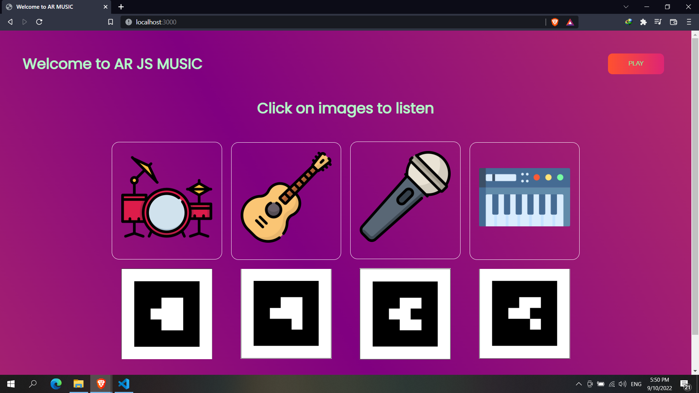

# Welcome to AR_JS_MUSIC

This is a **Augmented Reality Project** build with **[Node Js](https://nodejs.org/en/docs/)** and **[AR JS](https://ar-js-org.github.io/AR.js-Docs/)**.

Website Link - [AR_JS_MUSIC](https://handsome-trench-coat-ox.cyclic.app/)

## Play specific type of instruments with the help of AR(Augmented Reality).Turn your camera towards specific barcode for different instrument sounds.

  

 